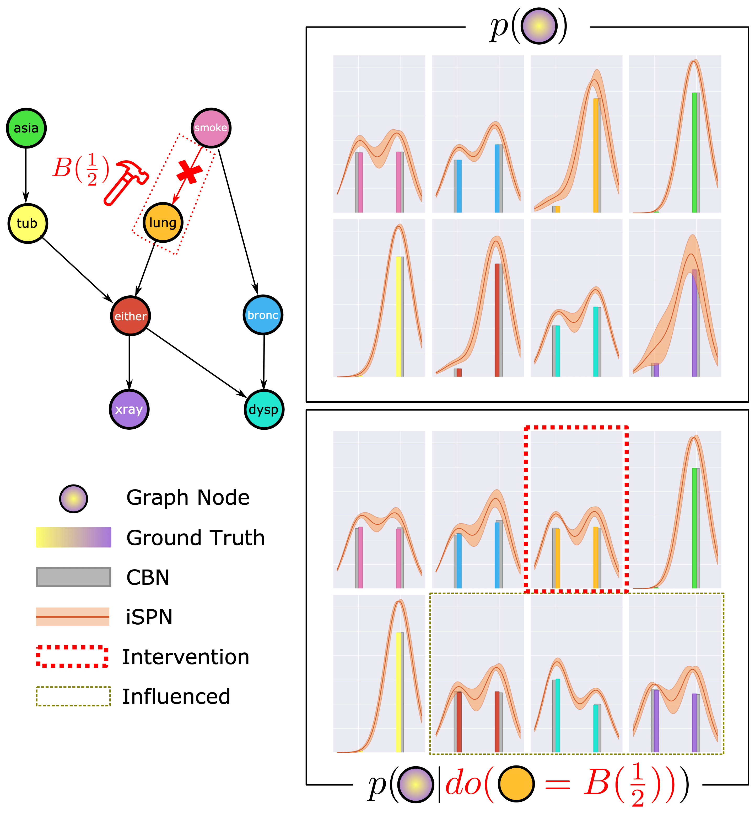

### Interventional Sum-Product Networks (iSPN)

Code repository for the identically titled paper submission to the 37th Conference on *Uncertainty in Artificial Intelligence* (UAI 2021).

> **Abstract**
> While probabilistic models are an important tool for studying causality, doing so suffers from the intractability of inference. As a step towards tractable causal models, we consider the problem of learning interventional distributions using sum-product networks (SPNs) that are over-parameterized by gate functions, e.g., neural networks. Providing an arbitrarily intervened causal graph as input, effectively subsuming Pearl’s do-operator, the gate function predicts the parameters of the SPN. The resulting interventional SPNs are motivated and illustrated by a structural causal model themed around personal health. Our empirical evaluation on three benchmark data sets as well as a synthetic health data set clearly demonstrates that interventional SPNs indeed are both expressive in modelling and flexible in adapting to the interventions.

This repository is being anonymized using https://anonymous.4open.science/ to account for the double-blind paradigm.
Date for given repository state: 18. February 2021.